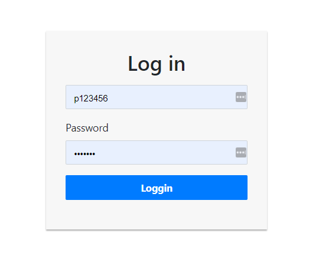

# Creating ReactJS forms with Formik & Yup

### Makes the React Application run
```js
// adding react-formik package. Using app based on [Create React App](https://github.com/facebook/create-react-app)
npx create-react-app react-formik
cd react-formik

// using yarn
npm install -g yarn

// we are going to need bootstrap
yarn add bootstrap

// adding basic styling
// adding yup form validation
yarn add formik styled-components yup

// start yarn
yarn start

// open browser to
open http://localhost:3000/
```

### Formik
#### What Formik does:
- Getting state values
- Validation and error messages
- Handling form submission on Form

#### What Formik provides out of the box:
Formik provides: Formik, Form, Field, and ErrorMessage.

#### How can I use Formik:

Just wrap the Form component inside Formik component:
```js
<Formik>
  <Form>
    {/* here will be dragons */}
  </Form>
</Formik>
```


#### What Yup does:
Yup is an object schema validator. Simple put it is a library that allows you to <b>define the blueprint of a JS object</b> and ensure that the object values match that blueprint through the validation process.

#### Custom and predefined fields
Formik provided pre-defined Fields out of the box, we will implement it and also create a new Custom field to compare both options

#### Schemas
Finally we will set a blueprint of the JS object in a object. So we can later on re-use it.

#### Screenshot




#### Further information
Thanks to Jared Palmer for this great tool, find more info here: https://react-hook-form.com/

---
<h4> Thanks </h4>
<h5> { 'Leo Lanese',<br>
       'Building Inspiring Responsive Reactive Solutions',<br>
       'London, UK' }<br>
</h5>
<h5>Twitter:
<a href="http://twitter.com/LeoLaneseltd" target="_blank">twitter.com/LeoLaneseltd</a>
</h5>
<h5>Portfolio
<a href="http://www.leolanese.com" target="_blank">http://www.leolanese.com</a>
</h5>
<h5>DEV.to:
<a href="http://www.dev.to/leolanese" target="_blank">dev.to/leolanese</a>
</h5>
<h5>Blog:
<a href="http://www.leolanese.com/blog" target="_blank">leolanese.com/blog</a>
</h5>
<h5>Questions / Suggestion / Recommendation ?
<a href="mail:to">developer@leolanese.com</a>
</h5>
